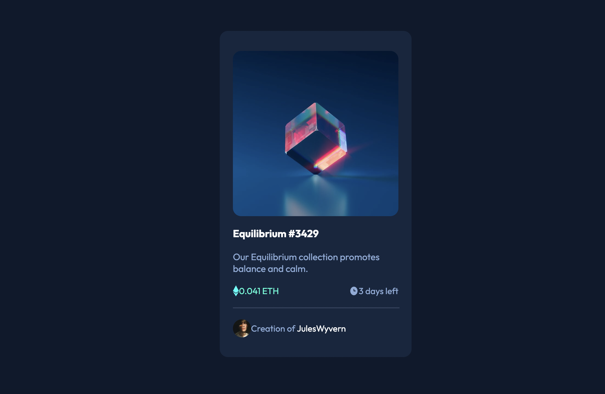

# Frontend Mentor - NFT preview card component solution

This is a solution to the [NFT preview card component challenge on Frontend Mentor](https://www.frontendmentor.io/challenges/nft-preview-card-component-SbdUL_w0U). Frontend Mentor challenges help you improve your coding skills by building realistic projects. 

## Table of contents

- [Overview](#overview)
  - [The challenge](#the-challenge)
  - [Screenshot](#screenshot)
  - [Links](#links)
- [My process](#my-process)
  - [Built with](#built-with)
  - [What I learned](#what-i-learned)
  - [Continued development](#continued-development)
  - [Useful resources](#useful-resources)
- [Author](#author)

## Overview

### The challenge

Users should be able to:

- View the optimal layout depending on their device's screen size
- See hover states for interactive elements

### Screenshot

### Links

- Solution URL: [Add solution URL here](https://your-solution-url.com)
- Live Site URL: [Add live site URL here](https://your-live-site-url.com)

## My process

### Built with

- Semantic HTML5 markup
- CSS Flexbox

### What I learned

I picked this up to be a quick project to breeze through and ended up learning a crucial lesson in style inheritance. I had a hard time keeping the eye overlay image from taking on its parent's properties. The fix was as simple as placing another div and adjusting some styling, but I had to clear my mind to get there. 

### Continued development

I want to continue to practice more complex design projects, with more effects. I want to try my hand at a landing page next.

### Useful resources

- [W3Schools](https://www.w3schools.com/cssref/sel_hover.php) - This helped remember how to implement hover.

## Author

- Github - [SOyeniyi801](https://github.com/SOyeniyi801)
- Frontend Mentor - [@SOyeniyi801](https://www.frontendmentor.io/profile/yourusername)